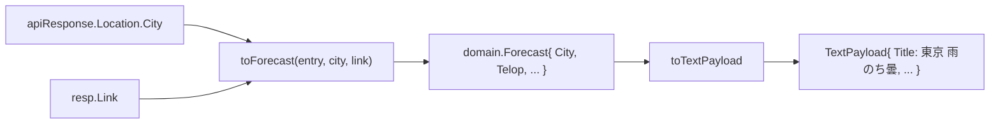

# Design Doc: 天気タイトルへの地点名表示

- **Author:** Arata Higashiguchi
- **Status:** Draft
- **Created:** 2026-07-25
- **Last Updated:** 2026-07-25
- **Reviewers:** TBD
- **関連:** [0002 天気連携 Design Doc](./0002-weather-integration.md)

---

## Context and Scope

[0002](./0002-weather-integration.md) で構築した天気連携（`WeatherSource`）は、quote/0 の `title` に天気概況（`telop`、例「雨のち曇」）のみを表示している。しかし **どの地点の天気なのかが表示上分からない**。地点コードは GitHub Actions Variables の `CITY_CODE`（既定 `130010`=東京）で注入されているが、その地点名は表示に反映されていない。

改善のため、`title` に **地点名を併記**する（例「東京 雨のち曇」）。

当初は「`CITY_CODE` に対応する地点名の enum / マッピング表を Go 側に用意する」案を検討したが、調査の結果 **天気 API（weather.tsukumijima.net）のレスポンスには既に地点情報が含まれている**ことが判明した（`location.city = "東京"`、[0002 のレスポンス構造](./0002-weather-integration.md#api-レスポンス構造前提知識)参照）。したがって自前のマッピング表は不要で、**API レスポンスの `location.city` をそのまま利用**する。

本 Design Doc のスコープ:

1. `title` への地点名併記（`地点名 + 天気概況`）
2. `location.city` を External DTO → Domain → TextPayload の 3 層へ引き回す型追加
3. 地点情報欠損時のフォールバック挙動

`config` / `batch.yml` / 環境変数は **無変更**（新しい env・secret を増やさない）。変更は `adapter/in/weather/`（`dto.go` / `source.go`）と `domain/weather.go` に閉じる。

### API レスポンス構造（前提）

トップレベルに `location` オブジェクトがあり、`city`（例「東京」）/ `prefecture`（例「東京都」）を含む。地点コード（`CITY_CODE`）に対応する地点名を API 側が返すため、コード側でコード→名称の対応を持つ必要がない。

```jsonc
{
  "forecasts": [ /* ... */ ],
  "location": { "prefecture": "東京都", "city": "東京" },
  "link": "https://www.jma.go.jp/bosai/forecast/#area_code=130000"
}
```

---

## Goals

- **G1**: quote/0 の `title` に地点名を併記し、どの地点の天気か一目で分かるようにする（例「東京 雨のち曇」）。
- **G2**: 地点名を `CITY_CODE` に自動追従させる。`CITY_CODE` を変えれば別地点でも地点名が正しく表示される（自前のコード表を持たない）。
- **G3**: 既存の 3 層型設計（DTO → Domain → TextPayload、[0002](./0002-weather-integration.md#型設計3-層)）を踏襲して `location.city` を引き回す。
- **G4**: 地点情報が欠損しても落ちず、`telop` のみ表示へ自然にフォールバックする。
- **G5**: `config` / `batch.yml` / 環境変数を無変更に保つ（新 secret・env を追加しない）。

## Non-Goals

- **`CITY_CODE` → 地点名の自前 enum / マッピング表を持つこと**（本 Design Doc で明示的に却下。[Alternatives](#alternatives-considered) 参照）。
- `message` 側レイアウトの変更（気温・降水確率・日付の書式は 0002 のまま）。
- 都道府県・地方（`prefecture` / `area`）の併記や、複数地点の同時表示。
- `title` 最大表示文字数（`titleMaxRunes`）の実機確定（[0002 の Open Question](./0002-weather-integration.md#open-questions) を継続）。

---

## Actual Design

### 概要

地点名は API レスポンスのトップレベル `location.city` から取得し、`link` と同じく Build 層から mapper へ引き回して `domain.Forecast` に持たせる。表示整形時に天気概況（`telop`）の前へ `地点名 + 半角スペース` を付与し、既存の `clipRunes` で上限クリップする。



### 型設計（3 層の差分）

**1. External DTO**（`adapter/in/weather/dto.go`）— トップレベル `location` を受ける型を追加。

```go
type apiResponse struct {
	Forecasts []forecast `json:"forecasts"`
	Location  location   `json:"location"` // 追加
	Link      string     `json:"link"`
}

// location は API レスポンスの地点情報。city を表示地点名に使う。
type location struct {
	City string `json:"city"` // 例「東京」
}
```

`location` が欠損・空でも Go の zero value で `City == ""` となり、表示は自然に `telop` のみへフォールバックする。`Validate()` の変更は不要（地点名は表示の付加情報であり、欠損を構造異常としない）。

**2. Domain model**（`domain/weather.go`）— 地点名フィールドを追加。

```go
type Forecast struct {
	Date         time.Time
	City         string     // 追加: 地点名（例「東京」）。空なら未取得
	Telop        string
	TempMinC     *int
	TempMaxC     *int
	ChanceOfRain RainChance
	Link         string
}
```

**3. Mapper / Presenter**（`source.go`・純粋関数）

- `toForecast` に `city` 引数を追加し（`link` と同じ引き回しパターン）、返す `Forecast` に設定する。
  ```go
  func toForecast(f forecast, city, link string) (domain.Forecast, error)
  ```
  `Build` 内は `toForecast(entry, resp.Location.City, link)` で呼び出す。
- `toTextPayload` のタイトル生成を「地点名 + 半角スペース + 天気概況」に変更。地点名が空なら `telop` のみ。上限クリップ（`clipRunes(..., titleMaxRunes)`）は従来どおり最後に適用する。
  ```go
  title := w.Telop
  if w.City != "" {
      title = w.City + " " + w.Telop
  }
  // ...
  Title: clipRunes(title, titleMaxRunes),
  ```

### 表示レイアウト（TextPayload の差分）

| フィールド | 変更前 | 変更後 |
| --- | --- | --- |
| `title` | `雨のち曇` | `東京 雨のち曇`（地点名 + 天気概況） |
| `message` / `signature` / `link` / `refreshNow` | — | 変更なし |

`titleMaxRunes = 11` は据え置く。市区名は通常 2〜4 文字で「東京 雨のち曇」= 7 文字に収まる。超過時は既存どおり末尾 `…` で rune 単位クリップされる。

### 欠損値ハンドリング

- `location` 欠損 / `city` 空 → `City == ""` → `title` は `telop` のみ（バッチは継続、正常系）。
- `telop` 空 / 当日エントリ不在 等の構造異常は [0002](./0002-weather-integration.md#欠損値ハンドリング方針) のまま（`Validate()`・選択ロジックでエラー）。

---

## Alternatives Considered

### 地点名の取得元

| 案 | 長所 | 短所 | 判定 |
| --- | --- | --- | --- |
| **API レスポンスの `location.city`** | 自前の対応表が不要、全 `CITY_CODE` へ自動追従、メンテ不要、0002 の「マッピング表を持たない」方針と整合 | API レスポンス構造に依存（欠損時はフォールバック） | ✅ 採用 |
| `CITY_CODE` → 地点名の enum / マッピング表 | 外部レスポンスに非依存 | 全国網羅に約 142 件の登録・継続メンテが必要、未登録コードは表示不可、[0002](./0002-weather-integration.md#link-遷移先yahoo-天気) が意図的に避けたマッピング表方針と不整合 | ❌ 却下 |

> API が地点コードに対応する地点名を返すため、コード側で対応表を維持する価値が低い。0002 でも「JMA コード → Yahoo URL」の対応表を保守コストとして避けており、本件も同方針を踏襲する。

### 地点粒度（表示に使うフィールド）

| 案 | 例 | 判定 |
| --- | --- | --- |
| `location.city` | 「東京 雨のち曇」 | ✅ 採用（簡潔。狭い `title` 幅に収まりやすい） |
| `location.prefecture` | 「東京都 雨のち曇」 | ❌ 却下（県名まで明示できるが文字数が増え、`titleMaxRunes` 超過リスクが上がる） |

---

## Cross-Cutting Concerns

### セキュリティ

- 新しい secret / env を追加しない。地点名は既存の天気 API レスポンスから取得する（追加の外部通信・認証なし）。

### 可観測性 / 失敗時挙動

- `location` 欠損は **正常系**として `telop` のみ表示で継続（失敗にしない）。
- 既存の異常系（4xx/5xx・タイムアウト・構造異常）の扱いは 0002 のまま。

### テスト / CI 品質

- fixture 駆動を踏襲。既存 `testdata/tokyo.json` / `tokyo_null_temp.json` は両方 `location.city = "東京"` を含むため、地点名反映の期待値更新に流用できる。
- 既存テスト更新: `toForecast` 呼び出しへ `city` 引数追加、`TestToTextPayload` / `TestWeatherSource_Build` の期待 `title` を「東京 雨のち曇」へ更新。
- 新規テスト追加: `location` を含まないレスポンスで `title` が `telop` のみへフォールバックすることを検証。
- CI（`ci.yml`）はネットワーク非依存のまま。

### コスト

- 追加の API 呼び出しはなし（既存レスポンスの未使用フィールドを読むだけ）。実行頻度・Actions 消費に影響なし。

---

## Milestones（PR 分割案）

1. `domain/weather.go` に `City` 追加 + `dto.go` に `location` 型追加。
2. mapper 更新（`toForecast` へ `city` 引き回し、`toTextPayload` のタイトル整形）+ テスト更新。
3. フォールバック（`location` 欠損）テスト追加。
4. 0002 のタイトル書式記述を「地点名 + telop」へ整合更新。

> 本 Design Doc（0003）の承認をもって上記実装に着手する。

---

## Resolved Decisions

- **地点名の取得元**: API レスポンスの `location.city`。自前のコード→名称マッピング表は持たない。
- **タイトル書式**: `地点名 + 半角スペース + 天気概況`（例「東京 雨のち曇」）。地点名が空なら `telop` のみ。
- **地点粒度**: `location.city`（市区名）。`prefecture` は使わない。
- **env / 設定**: 追加・変更なし。

## Open Questions

- `titleMaxRunes = 11` が地点名込みの `title` でも妥当か。市区名 + 長い `telop` の組み合わせでの見切れ具合を **実機で確認**する（0002 の Open Question を継続）。
